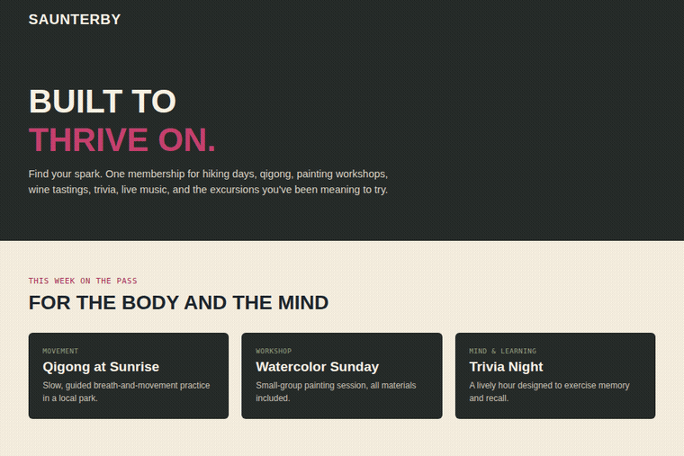

# Saunterby

A membership for adults 55+ who want to stay active, capable, and engaged — curated experiences, transportation, and benefits navigation handled by a human Navigator Team.

**This repository** contains the full source and materials for Saunterby, published independently on GitHub.
**Interactive demo:** [`/demo`](./demo) — a simplified, static walkthrough for illustration.

This repository is self-contained: the landing page, the pitch deck, supporting docs, and the full version history that led here, with no external hosting dependency.

## Demo media

**30-second product demo:**

[Watch the demo](./media/saunterby_demo.mp4)

**Interactive site walkthrough (GIF):**



**Brand outro / end card (GIF):**


---

## Repo structure

```
saunterby/
├── index.html              — the live landing page (current version)
├── demo/                   — simplified interactive demo page (static, illustrative only)
│   └── index.html
├── deck/                   — pitch deck, current (Saunterby-branded)
│   ├── Saunterby-Built-to-Keep-Going-Deck.pptx
│   └── Saunterby-Built-to-Keep-Going-Deck.pdf
├── docs/                   — supporting documents, current
│   ├── saunterby-application-answers.md
│   ├── pitch-narrative.md
│   ├── mvp-launch-plan.md
│   └── crm-template.csv
├── media/                  — demo assets
│   ├── saunterby_demo.mp4  — recorded 30-second product demo
│   ├── saunterby-demo.gif  — interactive site walkthrough
│   └── saunterby-outro.gif — 10-second brand end card
├── archive/                — historical versions, preserved as-is
│   ├── landing-pages/      — every landing page iteration, v1–v12
│   ├── pitch-narratives/   — pitch narrative drafts v1–v4
│   ├── EmberActive-Built-to-Keep-Going-Deck.pptx  — deck as originally submitted
│   └── ember-application-answers.md               — application as originally submitted
├── INTERNAL-changelog.md   — chronological, line-by-line build log (internal use)
└── CHANGELOG.md            — public-facing changelog (added separately)
```

## A note on naming history

This project was built and initially submitted under the working names **Ember**, then **EmberActive**. It was renamed to **Saunterby** after submission, for reasons documented in `INTERNAL-changelog.md`. The `archive/` folder preserves the EmberActive-branded submission materials exactly as filed — that record is intentionally left untouched. Everything outside `archive/` reflects the current Saunterby brand.
